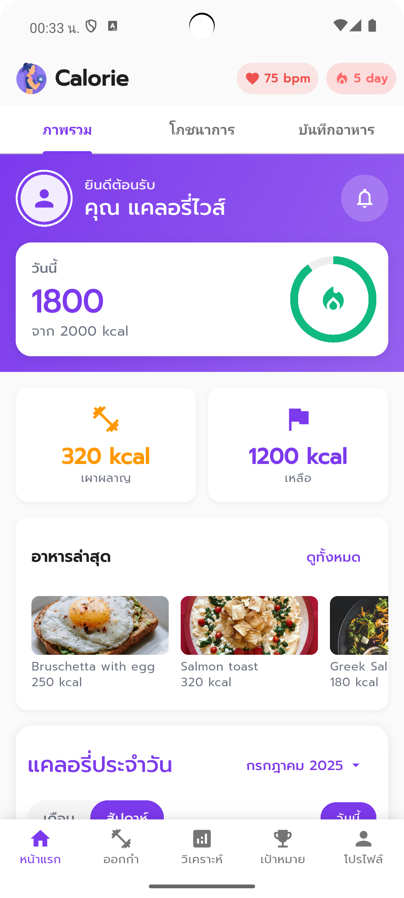
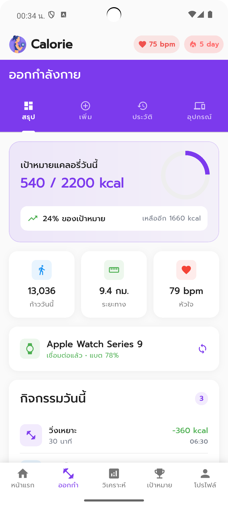
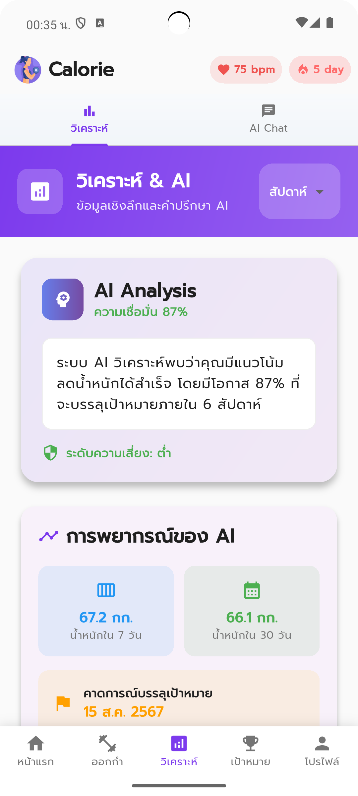
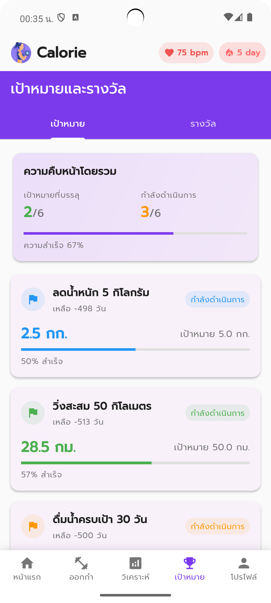
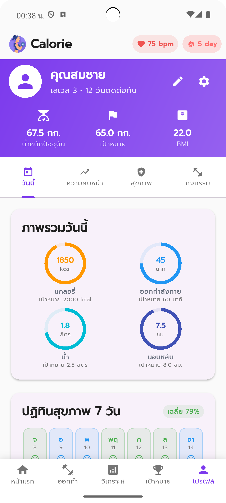

# CaloriWise

CaloriWise is a Flutter application designed to help users track and manage their daily calorie intake, supporting a healthier lifestyle and effective weight management.

## Features

- **Food & Drink Logging:** Easily record what you eat and drink throughout the day, with automatic calorie calculation.
- **Daily Calorie Goals:** Set and monitor your daily calorie targets to help achieve your health objectives.
- **Progress Tracking:** View your eating history and analyze trends in your calorie consumption and weight.
- **Health Insights:** Receive personalized recommendations and nutritional tips based on your eating habits.
- **Reminders:** Get notifications to help you stay on track with your goals.

## Getting Started

1. **Clone the repository:**
   ```bash
   git clone <repository-url>
   ```
2. **Install dependencies:**
   ```bash
   flutter pub get
   ```
3. **Run the app:**
   ```bash
   flutter run
   ```

## Folder Structure

- `lib/` - Main application code
  - `models/` - Data models
  - `screens/` - UI screens
  - `services/` - Business logic and data services
  - `theme/` - App theming
  - `utils/` - Utility functions
  - `widgets/` - Reusable widgets
- `assets/` - Images and other assets
- `test/` - Unit and widget tests

## Requirements

- Flutter SDK (latest stable version recommended)
- Dart SDK

## Contributing

Contributions are welcome! Please open issues or submit pull requests for any improvements or bug fixes.

## License

This project is licensed under the MIT License.

## Contact

For support or questions, please contact the developer at [your-email@example.com].

## App Screenshots

Below are some screenshots of CaloriWise in action:

<p align="center">
  
</p>

<p align="center">
  
  
  
</p>
<p align="center">
  
  
</p>
